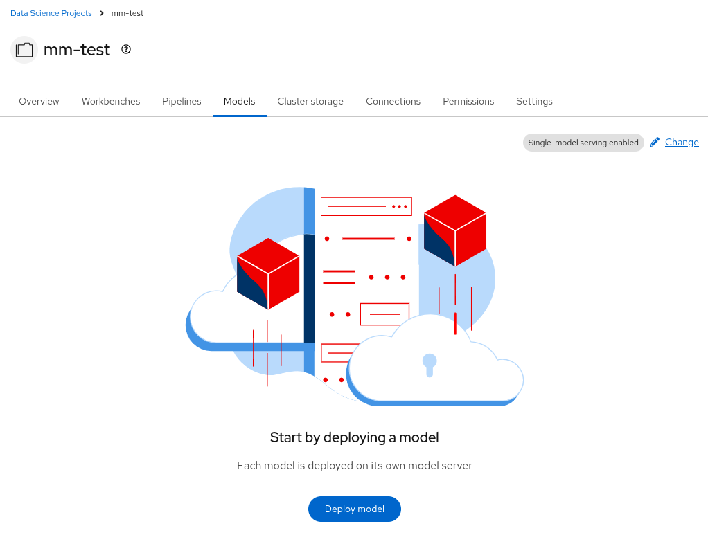
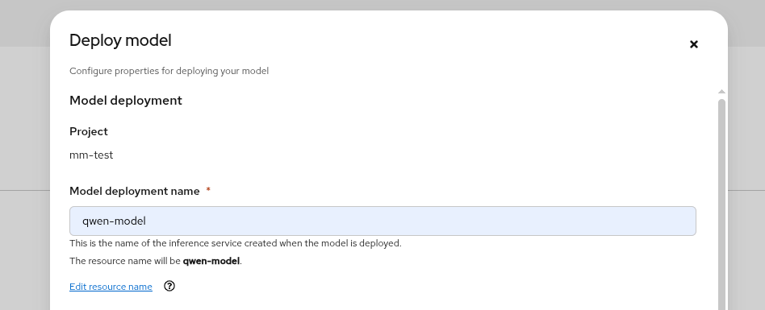
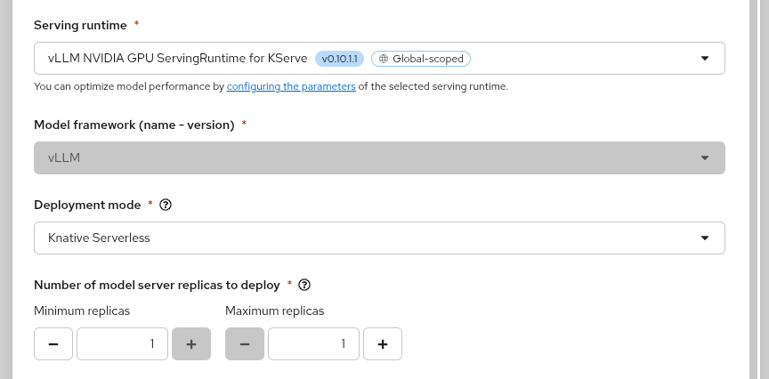
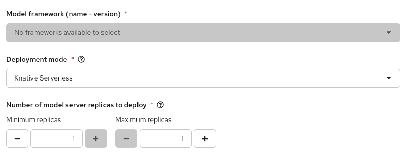
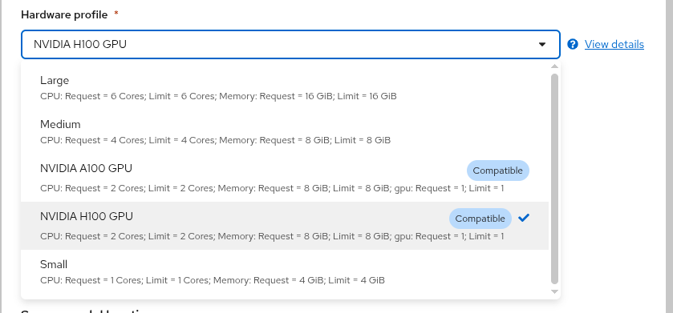
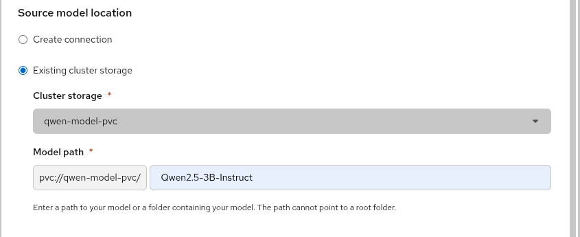

This document walks through serving a large language model with vLLM on OpenShift AI, using
the OpenShift AI dashboard to create the deployment. The model weights are read from a
PersistentVolumeClaim (PVC) in your project rather than from object storage.

The worked example deploys
[Qwen2.5-3B-Instruct](https://huggingface.co/Qwen/Qwen2.5-3B-Instruct), but the same steps
apply to any model vLLM supports, to do this substitute your own repository name and directory.

If you have not logged in to the cluster yet, start with the
[user onboarding documentation](/user-onboarding/).

## Before you begin

You will need:

- The `oc` CLI, logged in to the cluster. See
  [Logging in with the CLI](/user-onboarding/#logging-in-with-the-cli).
- Access to the OpenShift AI dashboard. See
  [Accessing OpenShift AI](/user-onboarding/#accessing-openshift-ai).
- A [HuggingFace access token](https://huggingface.co/settings/tokens), if the model you want
  to serve is a gated repository.
- Enough quota for a GPU workload. A 3B model at float16 needs one GPU, several CPU cores, and
  more memory than the default project quota allows. Check your quota with
  `oc get resourcequota` (see [Checking your quota](/user-onboarding/#checking-your-quota)) and
  open a ticket at <https://osticket.massopen.cloud> if you need it raised.

The dashboard can *select* an existing PVC as a model source, but it cannot *populate* one.
Everything up to [Load the weights onto the PVC](#load-the-weights-onto-the-pvc) prepares the
storage from the command line; from
[Start the deployment in the dashboard](#start-the-deployment-in-the-dashboard) onward, the work
happens in the dashboard.

## Project Checks

First make sure you are on your project and it is labeled correctly.

```
oc project <your-project-name-here>
```

Check if your namespace is labeled correctly:

```
oc get namespace <your-project-name-here> -o jsonpath='{.metadata.labels.modelmesh-enabled}{"\n"}'
false
```

You should see `false`.

Also check the dashboard label:

```
oc get namespace <your-project-name-here> -o jsonpath='{.metadata.labels.opendatahub\.io/dashboard}{"\n"}' 
true
```

You should see `true`.

If either label has the wrong value (or is empty), run:
```
oc label namespace <your-project-name-here> \
  opendatahub.io/dashboard=true \
  modelmesh-enabled=false \
  --overwrite
```

:::{note}
`modelmesh-enabled=false` is the value this walkthrough needs — it selects the single-model
serving platform (KServe + vLLM). Setting it to `true` switches the project to multi-model
serving with ModelMesh, and the deploy form shown later in this document is no longer offered.
The choice is per-project and either/or.
:::


## Create the model storage PVC

The PVC must be `ReadWriteMany` so that the loader job and the model server can both mount it.
On this cluster, `pure-fb-nfsv4` is the RWX-capable storage class.

```
oc apply -f - <<'EOF'
apiVersion: template.openshift.io/v1
kind: Template
metadata:
  name: model-pvc
parameters:
  - name: PVC_NAME
    description: Name of the PersistentVolumeClaim
    value: qwen-model-pvc
  - name: STORAGE_SIZE
    description: Size of the PVC
    value: 20Gi
  - name: STORAGE_CLASS
    description: StorageClass to use (cluster default is pure-fb-nfsv4, Pure FlashBlade over NFS)
    value: pure-fb-nfsv4
  - name: ACCESS_MODE
    description: Access mode (ReadWriteMany for file storage such as pure-fb-nfsv4, ReadWriteOnce for block)
    value: ReadWriteMany
objects:
  - apiVersion: v1
    kind: PersistentVolumeClaim
    metadata:
      name: ${PVC_NAME}
      labels:
        opendatahub.io/dashboard: "true"
      annotations:
        openshift.io/display-name: ${PVC_NAME}
    spec:
      accessModes:
        - ${ACCESS_MODE}
      storageClassName: ${STORAGE_CLASS}
      resources:
        requests:
          storage: ${STORAGE_SIZE}
EOF
```

Size the PVC for the model you are downloading, with room to spare. Qwen2.5-3B-Instruct is
roughly 5.8 GB across 12 files.

## Store your HuggingFace token

Skip this step if the model repository is not gated.

```
oc create secret generic hf-token --from-literal=token=<your-hf-token>
```

Do not put the token directly into a YAML file you intend to commit.

## Load the weights onto the PVC

This job mounts the PVC at `/mnt/models` and downloads the model into a subdirectory. If you are using a different model than the [Qwen2.5-3B-Instruct](https://huggingface.co/Qwen/Qwen2.5-3B-Instruct)
update the `MODEL_REPO` and `MODEL_DIR` variables.

```
oc apply -f - <<'EOF'
apiVersion: batch/v1
kind: Job
metadata:
  name: model-loader
spec:
  backoffLimit: 1
  template:
    spec:
      restartPolicy: Never
      containers:
        - name: loader
          image: registry.access.redhat.com/ubi9/python-311:latest
          env:
            - name: MODEL_REPO
              value: Qwen/Qwen2.5-3B-Instruct
            - name: MODEL_DIR
              value: Qwen2.5-3B-Instruct
            - name: HF_HOME
              value: /tmp/hf
            - name: HF_TOKEN
              valueFrom:
                secretKeyRef:
                  name: hf-token
                  key: token
                  optional: true
          command:
            - /bin/bash
            - -c
            - |
              set -euo pipefail
              export PYTHONUSERBASE=/tmp/pylibs
              pip install --quiet --user "huggingface_hub[hf_xet]"
              export PATH="$PYTHONUSERBASE/bin:$PATH"
              hf download "$MODEL_REPO" --local-dir "/mnt/models/$MODEL_DIR"
              ls -la "/mnt/models/$MODEL_DIR"
          volumeMounts:
            - name: model-store
              mountPath: /mnt/models
          resources:
            requests:
              cpu: "1"
              memory: 4Gi
            limits:
              cpu: "2"
              memory: 8Gi
      volumes:
        - name: model-store
          persistentVolumeClaim:
            claimName: qwen-model-pvc
EOF
```

Wait for it to finish:

```
oc wait --for=condition=complete job/model-loader --timeout=1800s
```

The transfer usually takes well under a minute for a model this size. Confirm the files landed:

```
oc logs job/model-loader | tail -20
```

You should see the contents of `/mnt/models/Qwen2.5-3B-Instruct` — `config.json`, the
`*.safetensors` shards, the tokenizer files, and so on. Note the directory name: you will type
it into the dashboard under
[Point the deployment at the PVC](#point-the-deployment-at-the-pvc).

## Start the deployment in the dashboard

In the OpenShift AI dashboard, go to **Data Science Projects → my-project → Models**, then
choose to deploy a model on the single-model serving platform. 

It should look like this:



To begin deploying a model, click **Deploy model** and fill in the form:

1.  **Model deployment name.** We will use the name `qwen-model`. You can use whatever name you
    choose, just make sure you update the field when you inference with the model.

    

2.  **Serving runtime.** We will use **vLLM NVIDIA GPU ServingRuntime for KServe**. The **Model
    framework** field autopopulates with `vLLM`.

    

3.  **Framework and deployment mode.** You do not need a framework, and in this example we can
    pick `Knative Serverless`.

    

    :::{note} Note on Knative Serverless
    **Advanced:** Advanced deployment mode uses Knative Serverless. By default, KServe integrates
    with Red Hat OpenShift Serverless and Red Hat OpenShift Service Mesh to deploy models on the
    single-model serving platform. You can also use a raw deployment here instead.

    **Number of model server replicas to deploy:** This defines the number of instances of the
    model server engine you want to deploy.

    Using the "Advanced" deployment mode, you can scale it up as needed by specifying the
    **Minimum replicas** and **Maximum replicas**, depending on the expected number of incoming
    requests.
    :::

    :::{tip} Scale to zero
    Once you deploy your model and obtain the inference endpoints, you can edit the deployment
    and set **Minimum replicas** to `0`. This enables intelligent auto-scaling of your model's
    compute resources (CPU, GPU, RAM, etc.), allowing replicas to scale up during high traffic
    and scale down when idle. With scale-to-zero enabled, the system reduces pods to zero during
    inactivity, eliminating idle compute costs — especially beneficial for GPU workloads. The
    model then scales back up instantly as soon as a new request arrives.
    :::

4.  **Hardware profile.** Pick **NVIDIA A100 GPU** *or* **NVIDIA H100 GPU** — we will use H100s
    in this example.

    


## Point the deployment at the PVC

5. Under the source model location, select the **Existing cluster storage** option. 

It should look like:




Two fields appear:

- **Cluster storage** — select `qwen-model-pvc`.
- **Model path** — this field is prefixed with a fixed, non-editable `pvc://qwen-model-pvc/`.
  Enter only the remainder:

    ```
    Qwen2.5-3B-Instruct
    ```

    OR

    ```
    <whatever-your-personal-model-path-is>
    ```

The resulting URI is `pvc://qwen-model-pvc/Qwen2.5-3B-Instruct`. The field is validated against
`/^pvc:\/\/[a-zA-Z0-9-]+\/[^/\s][^\s]*$/`, which in practice means:

- **No leading slash.** `/Qwen2.5-3B-Instruct` is rejected. This is easy to get wrong, because
  inside the loader pod the directory really is at `/mnt/models/Qwen2.5-3B-Instruct` — but the
  path here is relative to the root of the PVC.
- **Not empty.** The path cannot point at the PVC root; the model must live in a subdirectory.
- No whitespace. Dots and hyphens are fine.

If you see the warning *"The access mode of the selected cluster storage is not
ReadWriteMany"*, the PVC was not created as RWX. Recreate it with
`accessModes: [ReadWriteMany]` as shown in
[Create the model storage PVC](#create-the-model-storage-pvc).

## Deploy and verify

Click **Deploy**. The model appears in the project's model list and moves to a started state
once vLLM has loaded the weights — expect a few minutes, most of it spent reading the model off
the PVC and into GPU memory.

From the CLI you can watch the same thing:

```
oc get inferenceservice
oc get pods -l serving.kserve.io/inferenceservice=qwen-model
```

To follow the model server's startup:

```
oc logs -f -l serving.kserve.io/inferenceservice=qwen-model -c kserve-container
```

The dashboard shows the inference endpoint on the model's row once it is ready.
It should look like:

    

## Using the model

The deployment serves an OpenAI-compatible API. Using the endpoint from the dashboard:

```
curl -sk https://<endpoint>/v1/chat/completions \
  -H "Authorization: Bearer <token>" \
  -H "Content-Type: application/json" \
  -d '{
    "model": "qwen-model",
    "messages": [{"role": "user", "content": "What is OpenShift?"}],
    "max_tokens": 100
  }'
```

Drop the `Authorization` header if you deployed without token authentication. If you did not
expose an external route, the endpoint is only reachable from inside the cluster — run the
`curl` from a pod in your project, or use `oc port-forward`.

Other useful endpoints: `GET /v1/models` and `POST /v1/completions`.

## Cleaning up

GPUs are a scarce shared resource. Delete the deployment when you are not using it — either
from the dashboard, or:

```
oc delete inferenceservice qwen-model
oc delete job model-loader
```

Deleting the InferenceService releases the GPU. The PVC and its weights survive, so you can
redeploy later without downloading the model again. To reclaim the storage as well:

```
oc delete pvc qwen-model-pvc
```

### Troubleshooting

**Your project does not appear in the dashboard**

The namespace is missing the `opendatahub.io/dashboard=true` label.

**Only S3 / URI / OCI shown under source model location**

The PVC is missing the `opendatahub.io/dashboard=true` label. Add the label, then reload the page.

**"The access mode ... is not ReadWriteMany"**

The PVC was not created as RWX. Use the `pure-fb-nfsv4` storage class with `ReadWriteMany`.

**Model path rejected by the form**

The path contains a leading slash, or a path pointing at the PVC root.

**Model server pod stuck in `Pending`**

No hardware profile selected, so the pod has no toleration for the GPU node taint, or the
cluster has no free GPU.

**Deployment rejected, or pod never created**

Project quota exceeded. Check `oc get resourcequota` and request an increase.

**vLLM starts but cannot find the model**

The **Model path** does not match the directory the loader job wrote. Check
`oc logs job/model-loader`.

**Loader job fails with a 401 or 403**

The model repository is gated and the `hf-token` secret is missing, wrong, or lacks access to
that repository.

If you are stuck, open a ticket at <https://osticket.massopen.cloud>.
