(This document is also available as [a PDF document](user-onboarding.pdf).)
{.noprint}

## Logging on to the OpenShift Console

1. Send your email (associated with your organization or academic partner **NOT YOUR PERSONAL EMAIL**) to a member of the Red Hat team.

2. Once they’ve verified your addition, open a browser and navigate to this URL: <https://console-openshift-console.apps.oac-prod-workload0.hcp.oac.massopen.cloud> Your screen should look like this:

    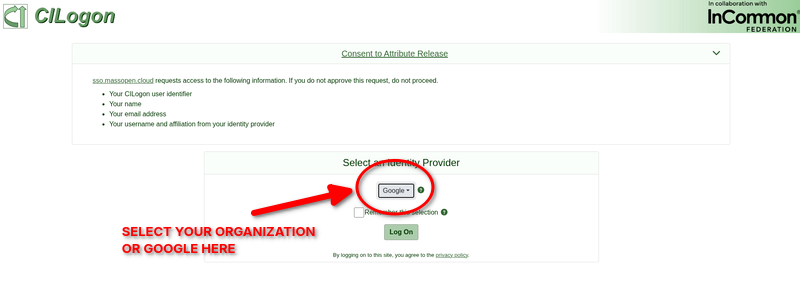

    If your organization has an identity provider you use which is listed the drop down, select that. If not, select Google as your identity provider, and **then click Log On**.

3. You will need to verify your email address. **CHECK THE EMAIL ADDRESS PROVIDED (INCLUDING YOUR SPAM)** for an email from the MOC Alliance.

    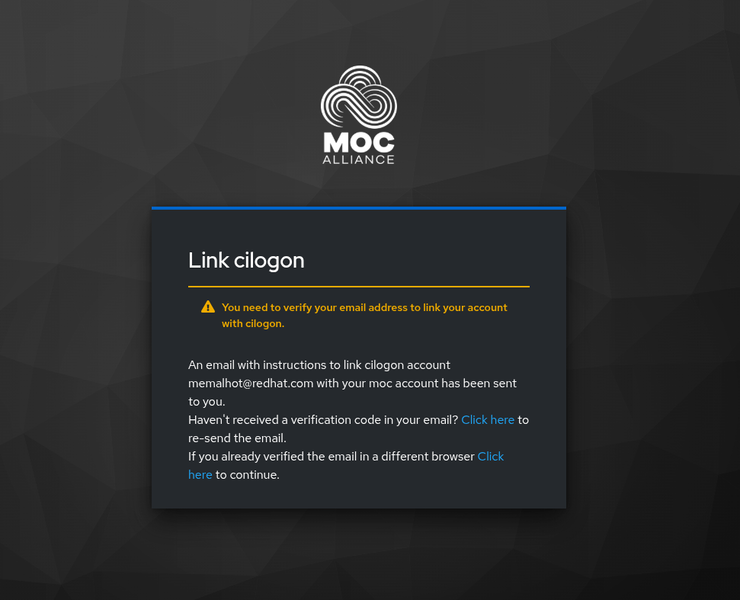

4. Once you see the email, click the confirmation link to confirm.

    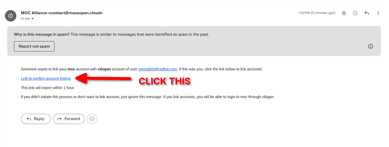

5. Then log in with the email you provided to the MOC team and press "Continue".

    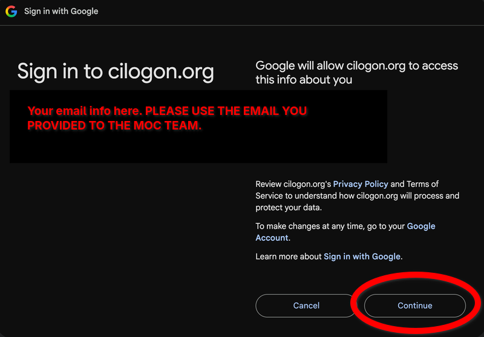

6. You will be brought to a page that has the terms and conditions. Scroll down and click accept:

    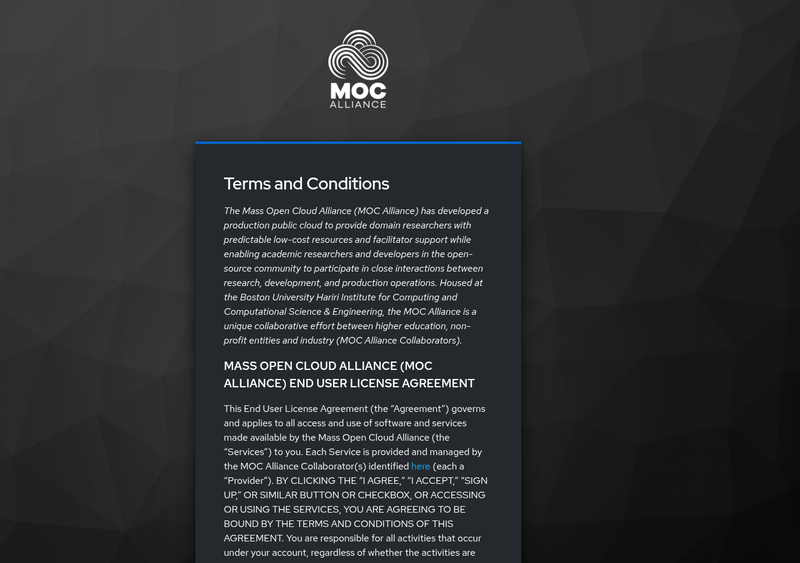

    Scroll down until you see the blue accept button...

    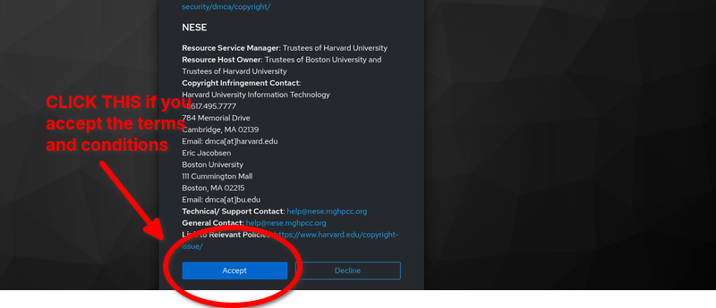

7. You will now be logged into the OpenShift web console. It will look like this:

    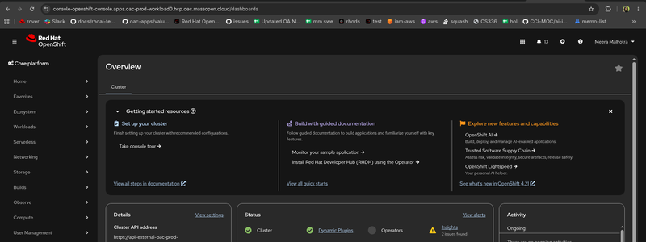

## Logging in with the CLI

1. To get started up with the `oc` command line tool, click the question mark in the upper right corner and select the "Command Line Tolls" option:

    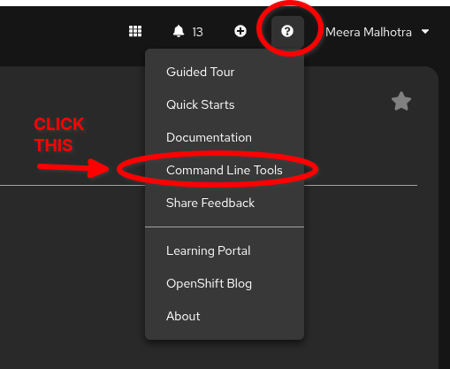

2. You should see this:

    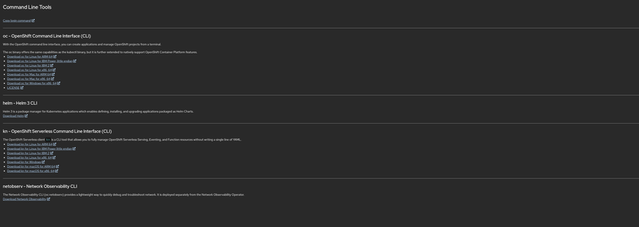

    Download the cli that is compatible with your operating system.

3. Once you have the `oc` cli binary, you can log in with your terminal. To do this, go to your terminal and type in:

    ```
    oc login --web https://api-external-oac-prod-workload0.hcp.oac.massopen.cloud:6443
    ```

    It will take you to your browser where you will see this:

    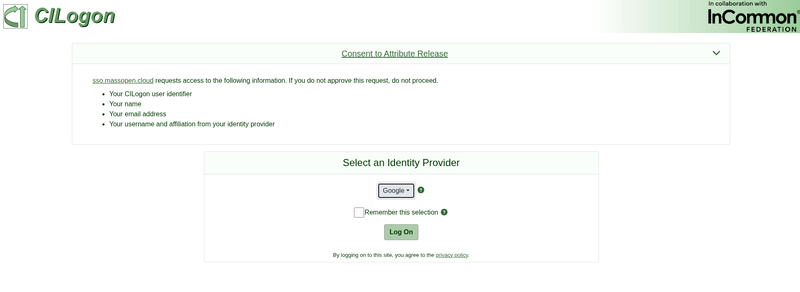

    Follow the steps to log in. When successfully logged in, you should see this:

    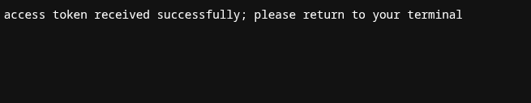

## Accessing OpenShift AI

1. You may want to not just use the OpenShift console, and want to take a look at at OpenShift AI. To do that, go to the console’s top right corner:

    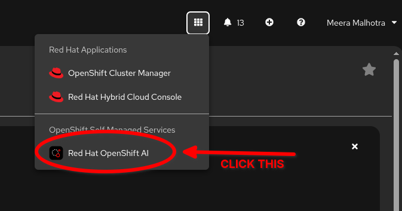

2. After that you should see OpenShift AI (**YOU MAY NOT SEE THE SAME PROJECTS**) :

    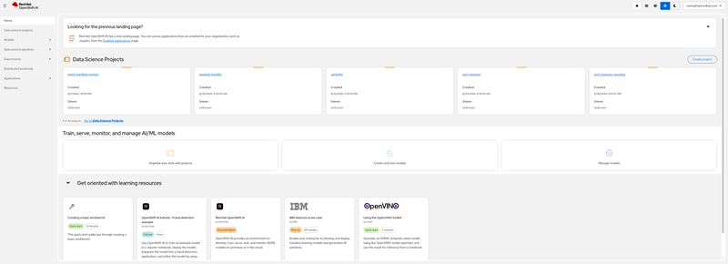

3. To return to the console, go to the right hand corner and click the 9 squares:

    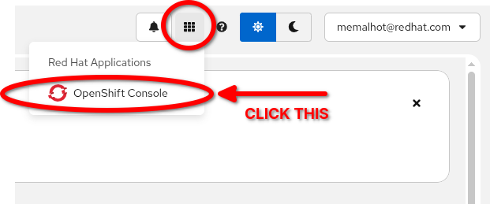
